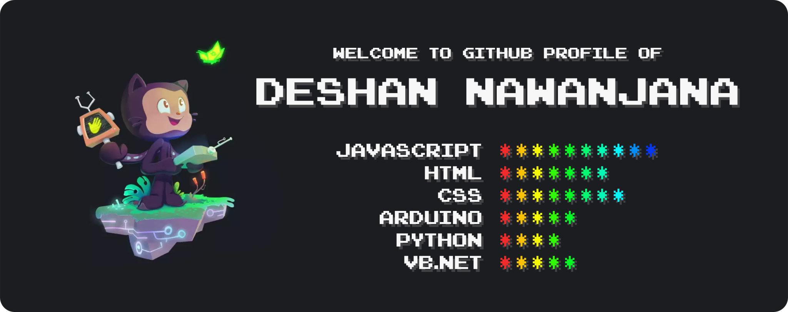

Hey fella... 👋😃 Thank you for being here! 😊 Myself **[Deshan Nawanjana](http://deshan-nawanjana.github.io/)**, more than being a **Software Engineer** 👨🏻‍💻, I am a **Problem Solver**, a **Creator**, an **Innovator**. 🌟 I spend everyday looking for new ideas to make them work and share with you all! 🎉🎊

Favorite Repositories

&nbsp;&nbsp;&nbsp;&nbsp;&nbsp;[**uno.js**](https://github.com/deshan-nawanjana/uno.js) - *JavaScript Library for Arduino* 
&nbsp;&nbsp;&nbsp;&nbsp;&nbsp;[**gravity.js**](https://github.com/deshan-nawanjana/gravity.js) - *2D Game Development Library* 
&nbsp;&nbsp;&nbsp;&nbsp;&nbsp;[**glyphs**](https://github.com/deshan-nawanjana/glyphs) - *SVG Icons Library for Web Development & Graphic Designing* 
&nbsp;&nbsp;&nbsp;&nbsp;&nbsp;[**logix**](https://github.com/deshan-nawanjana/logix) - *CMOS/TTL IC Testing Device Using Arduino* 
&nbsp;&nbsp;&nbsp;&nbsp;&nbsp;[**web-magnet**](https://github.com/deshan-nawanjana/web-magnet) - *Web Content Scraping Tool Using CSS Query Selectors* 
&nbsp;&nbsp;&nbsp;&nbsp;&nbsp;[**jwt-generator**](https://github.com/deshan-nawanjana/jwt-generator) - *Token Generators and Validators for JS, PHP and Python* 
&nbsp;&nbsp;&nbsp;&nbsp;&nbsp;[**scroller.js**](https://github.com/deshan-nawanjana/scroller.js) - *Infinite Loop Item Scroller for Vanilla & ReactJS* 

Other Collections

&nbsp;&nbsp;&nbsp;&nbsp;&nbsp;[**datasets**](https://github.com/deshan-nawanjana/deshan-nawanjana.github.io/tree/main/datasets) - *JavaScript Object Notation (.json), Extensible Markup (.xml)* 
&nbsp;&nbsp;&nbsp;&nbsp;&nbsp;[**tables**](https://github.com/deshan-nawanjana/deshan-nawanjana/tree/main/tables) - *Emojis, Shortcut Keys* 
&nbsp;&nbsp;&nbsp;&nbsp;&nbsp;[**scripts**](https://github.com/deshan-nawanjana/deshan-nawanjana/tree/main/scripts) - *Registration Entries (.reg), Windows Batch Files (.bat)* 

[DNJS](https://dnjs.info/)
&ensp;|&ensp;
[LinkedIn](https://www.linkedin.com/in/deshan-nawanjana/)
&ensp;|&ensp;
[Twitter](https://twitter.com/DeshanNawanjana)
&ensp;|&ensp;
[GitHub](https://github.com/deshan-nawanjana)
&ensp;|&ensp;
[YouTube](https://www.youtube.com/channel/UCfqOF8_UTa6LhaujoFETqlQ)
&ensp;|&ensp;
[Blogger](https://dn-w.blogspot.com/)
&ensp;|&ensp;
[Facebook](https://www.facebook.com/mr.dnjs)
&ensp;|&ensp;
[Gmail](mailto:deshan.uok@gmail.com)